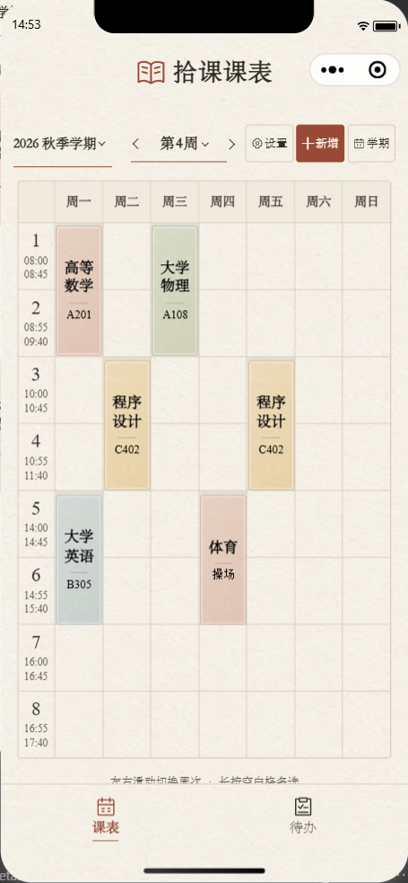
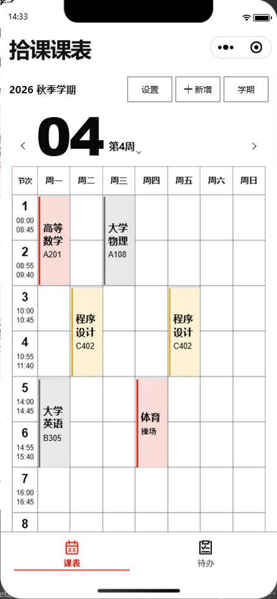
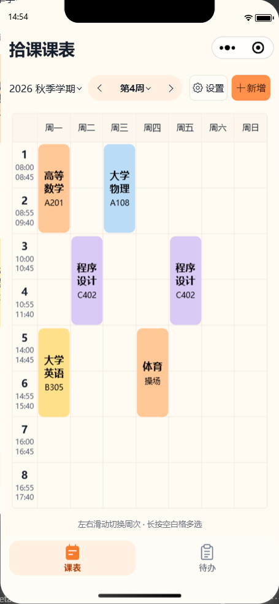
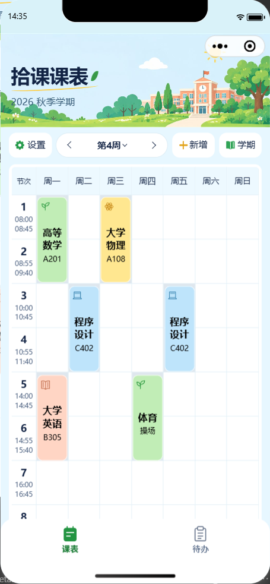
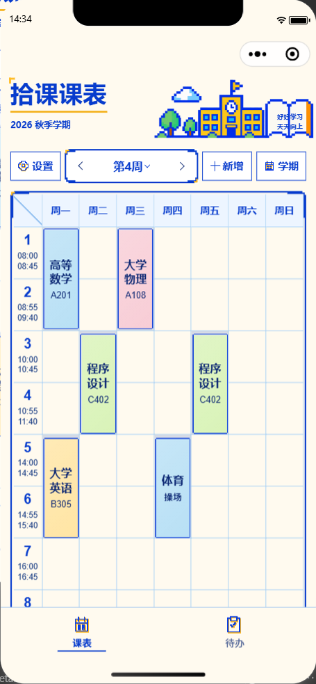

# 五套外观与主题系统验收

日期：2026-09-29。以下记录主题开发阶段的本地验收；主题实现与后续代码审查修复统一通过 PR 审核，尚未上传或发布微信版本。

## PR 视觉参考

以下五张截图复制自本记录所述的 390×844 原生模拟器验收，使用合成课表数据，原文件未修改。A／C 来自默认主题与去灰边验证，B／E／F 来自字体精修及回归验证；它们是代码审查前的外观证据，不代表 2026-09-30 重新运行了模拟器或完成真机验收。代码审查对 UI 文件的一致性检查见 [代码审查记录](代码审查记录-2026-09-29.md)。

| A 纸上拾课 | B 秩序之间 | C 奶油积木 | E 校园晴日 | F 像素课间 |
| --- | --- | --- | --- | --- |
|  |  |  |  |  |

## 默认 A 与 C 课程块去灰边（当前）

按进一步反馈，将统一默认值改为 A「纸上拾课」。首次使用、无偏好的升级、读取异常或无效偏好均回退 A；已保存的五套合法偏好继续恢复，不强制覆盖。启动底色、独立日期组件默认值和不含个人数据的分享预览同步使用 A。

C 的灰边来自圆角课程下方的占用格灰底；现仅在 C 中将该底色设为透明，同时去掉卡片内阴影和渐变，保留 16rpx 圆角、七列网格和占用禁选／多选反馈。A／B／E／F 的课程样式不变。

- `npm.cmd --prefix wechat-timetable run check`：TypeScript 与 **362 项测试**通过，0 失败。覆盖无效偏好只读回退、五套已保存偏好恢复、只预览与应用失败、数据隔离等。`git diff --check` 通过。
- 390×844 的 iPhone 12/13 (Pro) 原生模拟器、基础库 3.17.2，完成 4 张定向截图。实测 C 占用格底色透明，卡片 `box-shadow`／`background-image` 均为 `none`，圆角仍为 16rpx；多选正常。无偏好与无效偏好进入 A，保存的 C 重初始化后仍为 C，通用分享预览使用 A。
- 无运行异常；全部真实 Storage 键和值在验证前后相等。验证使用内存合成课程，未改写用户的课程、待办、备份或实际外观偏好。

截图与报告：`dist/default-paper/`、`dist/default-paper/report.json`；测试日志：`dist/default-paper-check.log`。本轮未重新验证 360／430px 或真机；下方历史截图不作为本次修改后的设备验收证据。

## A／B／F 字体、排版与课程块精修（此前记录）

在已完成的三套外观上继续对照原始六屏参考图，调整全部页面的同角色字体层级、标题位置、正文行距、表单与列表对齐，以及课程块内的名称／教室关系。没有修改课程、待办、备份或偏好存储流程；C／E 保持既有外观。

- A：强化宋体标题与正文的层级，节次、时间和教室编号采用同基线数字；课程便签边缘减淡，补齐课表外框，统一课程名与教室之间的短分隔线。居中子页标题，调整引语位置和删除操作两侧细线。
- B：统一粗体标题、日期与数字排版；课程名和教室左对齐，课程色条与正文保留明确间距，补齐表头顶部横线；设置与表单的字号、行距和箭头规则统一。
- F：去掉标题的额外文字阴影，调整标题与书本题字位置；单独制作适合课程小色块的本地阶梯边框，统一课程字重、教室行距和像素箭头。继续使用系统中文，不加载字体包。

### 本轮检查证据

原生环境为微信开发者工具、基础库 3.17.2、**iPhone 12/13 (Pro)，390×844 逻辑尺寸**。首轮采集 42 张截图，覆盖 A／B／F 全部 11 页、月历展开、课表多选和外观预览滚动状态。检查后集中修正 A 数字基线与外框、B 表头横线；第二轮更新其中 12 张相关页面截图，并补充 28 张边界／回归截图。第二轮的最新截图覆盖对应首轮截图；不将两轮截图总数当作独立页面数量。

- 实测编辑页标题居中、返回按钮至少 44px；课表保留七列、124rpx 行高和 80rpx 表头。单节长课程名／教室、14 节课表底部均未越出课程块，长内容按原规则省略。
- 检查空课表、读取错误、长目标、随想保存失败及保存中；42 格月历触控高度至少 44px。C／E 的课表和待办回归通过，课程圆角仍为 16rpx（当前设备实测 8px）。
- 两轮均无运行异常、无清理错误；内存替身隔离合成数据，测试后恢复原外观与真实存储 API，逐项比较全部真实 Storage 键和值，完全相等。
- `npm.cmd --prefix wechat-timetable run check` 通过 TypeScript 与 **361 项测试**，0 失败；`git diff --check` 通过。日志：`dist/abf-type-check.log`。

原图／上一版／本轮对照页：`dist/abf-type/index.html`。首轮报告：`dist/abf-type/report.json`；第二轮报告：`dist/abf-type-bounds/bounds-report.json`。脚本：`dist/verify-abf-type.cjs`、`dist/verify-abf-type-bounds.cjs`。上一版截图为 430px，本轮为 390px，对照页明确标注宽度差异，仅用于样式比较。浏览器自动化受请求头策略加载失败阻塞，对照页完成资源链接和脚本静态检查；小程序验收使用原生运行截图。

### 本轮仍需手动复核

| 设备或环境 | 当前边界 | 手动检验重点 |
| --- | --- | --- |
| 360px 原生模拟器，例如 Nexus 5 | 当前自动化接口不能切换机型 | 三套外观标题、工具栏、单节课程长中文与七列课表无横向溢出 |
| 430px 原生模拟器，例如 iPhone 15 Pro Max | 上一轮新增外观已验收；本轮字体精修仅在 390px 重新验证 | 标题居中、课程字重与间距、底部安全区、长表单滚动 |
| iOS／Android 真机 | 未连接实际设备，模拟器无法证明系统字体与辅助功能表现 | A 宋体与数字字体回退、F 阶梯边缘、字体放大、键盘遮挡、VoiceOver／TalkBack、滑动切周和长按多选 |

以下保留此前新增外观及 C／E 的验收记录；设备结论以上方本轮记录为准。

## A／B／F 新增实现（精修前记录）

在既有 C／E 上加入 A「纸上拾课」、B「秩序之间」、F「像素课间」，默认仍为 C。以原始日常使用／编辑与管理六屏参考图为依据，覆盖全部 11 页、月历展开、课表多选及共用组件；不是仅替换配色。

- A：暖纸纹理、系统宋体优先、墨棕正文、砖红操作、便签课程、细线与枝叶章节装饰、连排设置和目标列表。
- B：大号两位周次、粗体日期、黑白直角网格、课程侧边色条、分栏表单、黑白设置图标和朱红操作。
- F：单独生成并压缩像素校园、蓝色标题与黄色下划线、像素图标、阶梯边框、蓝框输入与按钮。正文使用清晰系统字体。
- 外观选择扩为五张卡片、两列布局，预览只用合成数据；明确应用才保存。课程自动七色位、课程 V5／待办 V3、旧颜色兼容、备份格式和独立偏好键均保持原规则。

### 首轮检查与集中修正

430×932 的 iPhone 15 Pro Max 原生模拟器、基础库 3.17.2，首轮采集 39 张运行截图。实际检查发现原生按钮默认边距导致外观卡片单列居中，部分页面的局部样式恢复了旧圆角／设置图标底色，A 无副标题子页的装饰留白偏多，F 阶梯边缘偏弱。已集中修正这些问题，强化 F 课程与面板边缘、收紧 A 空装饰区，并保留 C／E 的课程圆角。

首轮报告：`dist/abf-first/report.json`。三套主题的实际 Tab 切换、Tab 至少 44px、设置返回第 4 周、课程草稿／目标草稿／浏览月份保留均通过。检查全程使用内存存储替身；结束恢复真实存储 API 与原外观，逐项比较全部真实 Storage 键和值，完全相等。无运行异常或清理错误。

### 复核证据

集中修正后采集 **42 张**最终运行截图：每套 11 页、展开月历、课表多选，以及外观预览／应用区的滚动状态。外观卡片实测两列；实际 Tab 切换、44px Tab、设置返回周次再次通过。无运行异常、无清理错误，全部真实 Storage 键和值仍完全相等。

原效果图／实际运行对照页：`dist/abf-final/index.html`。原图只在页面中缩放展示，点击可查看未修改的完整图片。最终报告：`dist/abf-final/report.json`；脚本：`dist/verify-abf-final.cjs`。这些截图来自真实小程序组件，不用新生成的效果图替代验收。

另完成 **25 张**边界及回归截图：A／B／F 各检查单节长课名与长教室、14 节课表底部、空课表、读取错误、长目标、随想保存失败和保存中；C／E 各复核课表与待办。测量确认七列和原 124rpx 节次行高、80rpx 表头保持一致，课程文字没有越出色块，42 格月历的日期触控高度至少 44px。C／E 课程圆角仍为 16rpx（当前设备实测 9px）。长课名按既有行数省略，不缩小文字；页面滚动后固定导航与底部安全区正常。报告：`dist/abf-bounds/bounds-report.json`；脚本：`dist/verify-abf-bounds.cjs`。无运行异常或清理错误，全部真实 Storage 键和值不变。多选画面通过原页面方法进入状态，真实长按和滑动手势留给下方真机清单。

`npm.cmd --prefix wechat-timetable run check` 通过 TypeScript 与 **361 项测试**，0 失败；覆盖率为行 78.10%、分支 88.63%、函数 80.68%。新增验证 A／B／F 的只预览、明确应用、偏好恢复、全部业务／备份存储隔离，以及 14 行课表中的同组配色、原坐标和选中状态。五套色板均验证正文与主操作对比度、七个课程色位及图标资源存在。日志：`dist/abf-check.log`。

### 本轮需要用户手动检验的设备

用户已允许受阻机型转交手动验收，本轮不以这些设备阻塞本地交付。

| 设备或环境 | 当前边界 | 手动检验重点 |
| --- | --- | --- |
| 360px 原生模拟器，例如 Nexus 5 | 当前自动化接口不能切换机型；本轮只有 430px 的新主题原生截图 | A 工具栏换行、B 大号周次和日期、F 月历工具、五套外观卡片、七列课表横向无溢出 |
| 390px 等其他宽度 | 旧 C／E 截图不作为新增 A／B／F 的证据 | 长中文、表单滚动、固定导航和底栏安全区 |
| iOS 真机 | 模拟器不能替代系统字体、键盘、VoiceOver 和真实冷启动 | A 宋体回退、F 阶梯边缘、输入不被键盘挡住、切换外观后重启保持偏好 |
| Android 真机 | 未连接实际设备 | 字体放大、TalkBack、键盘、返回手势、底部安全区、滑动切周和长按多选 |

每套外观建议依次打开课表、待办、展开月历、编辑课程、设置、备份，再检查外观切换前后草稿和选定日期保留。静态参考图中的系统状态栏、手动选色等与当前功能决定不同，不声称所有设备逐像素相同。

新增素材的源文件保留在 `assets/appearance/abf/`。全部运行时 appearance 资源现为 87 个文件、157,685 字节（约 154 KiB），另有纸纹与阶梯边框的本地 data URL；没有字体包或远程资源。

---

以下为此前 C／E 的实现与验收历史，原记录保留。

## 验收依据与范围

以已生成的 C「奶油积木」、E「校园晴日」日常使用／编辑与管理六屏效果图为视觉依据。用户明确指出首轮仅换色，随后授权自定义导航栏与 Tab，以还原标题、插画、底部选中背景及页面构图。首轮记录保留在 `archive/主题系统首轮记录-20260928.md`，不能将其 430px 检查当作本次重做的验收证据。

当前实现包括：

- C 默认与 E 可切换、独立偏好、只读合成预览、写入读回及失败恢复；原青绿色不在运行时。
- 全部 11 页接入共同页头，测量状态栏和微信胶囊；自定义双 Tab 保留原生页面路由，实际切换成功后才显示对应选中状态。
- 重写课表工具栏与网格视觉、待办目标行／随想完整区块、C 独立设置卡片／E 分隔列表、课程编辑输入与按钮、备份分组和空状态。E 首页标题与插画融合，不再额外堆放横幅。
- E 设置页补充书本幼芽插画；E 表单提供输入清除入口，C／E 采用各自菜单图标与 Tab 图形。
- 课程颜色使用稳定七色位；课程 V5、待办 V3、旧颜色字段和备份结构不变。主题更新不改变业务数据或编辑草稿。

## 与静态效果图的明确差异

- 按后续需求移除课程手动选色，在设置中新增“外观”入口。
- 微信胶囊、状态栏、刘海与底部安全区取真实设备值；课程格子与多选命中区域共用同一行高和定位规则。小屏允许滚动，不缩小触控区域来塞满首屏。
- C 橙色按钮使用深棕文字，以满足正文对比度；原图中的低对比白字不照搬。
- 月历保持七列六行和至少 44px 日期目标。首屏展示多少目标、是否露出随想取决于设备高度，不能用截短数据或隐藏操作来模拟静态图片。
- 校园插画和书本为按参考图单独制作的运行时资源，界面本身全部使用真实组件；没有将整张效果图作为页面背景。

## 自动化证据

`npm.cmd run check` 通过：TypeScript 与 **359 项测试**，0 失败。覆盖率：行 77.94%、分支 88.56%、函数 80.65%，通过既有门槛。`git diff --check` 通过。

覆盖主题回退、保存失败恢复、预览／应用隔离、课程稳定配色、对比度、数据兼容、主题刷新不丢草稿、设置返回周次、网格几何及选中状态。新增导航测试覆盖 360／390／430px 胶囊尺寸计算、无效测量回退、返回边界、Tab 不提前显示错误选中态和滚动时的导航背景／紧凑标题。**这些尺寸计算测试不等同于对应机型的原生视觉验收。**

## 390px 首轮运行证据（细节修正前）

微信开发者工具，基础库 3.17.2，iPhone 12/13 (Pro)，390×844 逻辑尺寸。

- 首轮按相同合成课表检查 C／E 六个核心状态，集中修正默认按钮样式造成的返回位置、输入形态和图标细节。
- 修正后复核 **26 张运行截图**：每套 11 页、展开月历、课表多选。无运行异常。
- 实际点击自定义 Tab 可正确切换路由与选中态，Tab 测量高度至少 44px。
- 从设置返回仍在第 4 周；切换主题后课程草稿、目标草稿、浏览月份及待办日期保留。
- 边界检查完成 20 张截图：1／14 节课表、长中文、空数据、错误提示、保存中状态、长表单底部；七日网格与 42 天月历结构正确，日期按钮与切周箭头至少 44px。
- 边界检查发现旧页头会随长页面滚出视口，已改为固定导航并保留状态栏遮罩。修正后单独复核 6 张截图：C／E 长课表滚动、备份页底部和回到顶部；导航保持在胶囊安全区，底部实际点击返回成功，返回顶部恢复完整页头。此项以最新 `dist/ce-scroll/` 为准，较早的边界截图不作为最终滚动导航证据。
- 全流程使用内存 mock 提供合成课表、目标与随想，偏好也只写入该内存空间。结束恢复 mock 和原主题，并逐项比较真实全部 Storage 键和值，完全一致。

本机原图与对照页：`dist/ce-final/index.html`；原生执行报告：`dist/ce-final/report.json`；脚本：`dist/verify-ce-final.cjs`。对照页上排为原效果图、下排为实际运行截图，不以新生成图片替代运行证据。

边界报告：`dist/ce-bounds/bounds-report.json`；固定导航复核：`dist/ce-scroll/report.json`。三个报告均无运行异常，均确认全部真实存储键和值未改变。完整 26 屏已在固定导航修正后重新采集，随截图复核 Tab、周次和编辑状态保护均通过；滚动后的表现使用固定导航复核截图。

随后按原图定向修正备份页的主题图标与空状态：C 为橙色文档／蓝色导入／紫色时钟，E 为绿色导出／黄色导入／蓝色时钟；颜色与资源路径从主题配置统一获取。课程编辑页在“全部周”下显示实际学期的周数范围。两套外观共 4 张更新截图已替换进对照页，原生验证见 `dist/ce-detail/report.json`：无运行异常、无真实存储变化，周数说明与实际学期一致。

## 根据用户顶部截图补齐细节

用户指出课表顶部仍有差异，本轮直接对照原 C／E 日常使用效果图和用户提供的截图，完成以下调整：

| 原差异 | 当前实现 |
| --- | --- |
| C 学期文字偏小、学期后方留白大，周次条与操作按钮比例失衡 | 学期字号由 23rpx 增至 27rpx；周次、按钮文字为 26rpx；C 按内容分配宽度，E 加宽三个操作按钮并收短周次条 |
| 胶囊和按钮可见高度过大，箭头、加号与文字形态不统一 | 可见按钮高度 36px，外层点击高度至少 44px；切周箭头统一为折线，加号与文字居中 |
| C 与 E 共用绿色设置线形图标 | C 改用深色线形齿轮，E 改用绿色实心齿轮及书本图标，资源由主题定义派生 |
| 待办日期为实心三角下拉，区块图标偏小，E 选中日期色块偏深 | 改为空心折线下拉和统一深色箭头；提高区块图标与标题层级；E 选中日改为浅绿底深色字 |
| 未选中 Tab 图标过度简化，文字偏粗 | 使用带日期点的日历、带夹板的清单线形图标；未选中文字恢复常规字重 |

430px（iPhone 15 Pro Max）定向复核完成 8 张截图，包含 C／E 课表、第 18 周、待办及展开月历。实际点击上一周／下一周／设置／新增／学期入口均通过；设置返回保持原周次；切周箭头、周次入口、操作按钮的实测触控范围至少 44px，按钮可见高度实测 36px，无横向越界。原生执行无异常，真实 Storage 全部键和值保持一致。证据：`dist/ce-toolbar/report.json`；最后静态检查日志：`dist/ce-toolbar-check.log`。

本轮对照页：`dist/ce-polish/index.html`。顶部依次展示原效果图、用户指出的问题截图、修改后的实际运行图；只在 HTML 中裁切展示原图，不修改截图像素。

## 430px 全站复核

本轮细节修正后，在 430×932 的 iPhone 15 Pro Max 模拟器补齐 C／E 全部 11 页、展开月历和课表多选，共 26 张截图。自定义 Tab 点击、至少 44px Tab 触控高度、设置返回第 4 周、主题切换后的课程草稿／目标草稿／日期和浏览月份均通过。执行无运行异常，真实全部 Storage 键和值完全一致，清理无错误。

证据：`dist/ce-wide/report.json`；脚本：`dist/verify-ce-wide.cjs`；截图：`dist/ce-wide/430-*.png`。完整对照页 `dist/ce-final/index.html` 已更新为这组最新 430px 截图；早前 390px 报告与截图保留，不混作本轮细节修正后的窄屏证据。

## 根据用户网格截图细化课表

本轮只调整 `timetable-grid` 和主题中的网格专用颜色，不修改课程数据、自动配色规则、节次常量或业务事件。

- C 按原参考图将左上角留空，外框贴合网格，去掉外层内边距上的重复框线；E 保留“节次”和浅蓝表头。
- 网格线独立使用 `grid-line`，时间文字独立使用 `grid-time`；线条减轻，同时提高起止时间的清晰度。
- 节次字号 30rpx、起止时间 20rpx；跨节课名 27rpx、教室 22rpx，单节课名 25rpx、教室 21rpx。课程名不被教室挤压，长名称分别最多三行／两行，长教室单行省略。
- C 色块增加轻微亮面和浅色内边缘，E 图标保持独立顶部空间；两套继续使用相同的 124rpx 行高、80rpx 星期栏、16rpx 上下内边距和原课程坐标。

本轮 `npm.cmd --prefix wechat-timetable run check` 通过 TypeScript 与 359 项测试，0 失败；`git diff --check` 通过。日志：`dist/ce-grid-check.log`。本轮原生截图和报告单独存放在 `dist/ce-grid/`，此前全站截图保留为上一轮记录。

430px 原生模拟器完成 C／E 共 12 张定向截图，覆盖原参考图示例、用户截图中的三门课、1／9／14 节、长课程名与长教室、空教室和多选状态。测量确认课程文字与图标未越出色块，七列与节次高度保持原规则。多选通过程序设置进入状态检查布局；自动化组件触摸定位在页面返回后出现超时，本轮不将其计为真实长按手势验收。最终截图脚本执行无运行异常，清理无错误，全部真实 Storage 键和值保持一致。报告：`dist/ce-grid/report.json`；脚本：`dist/verify-ce-grid.cjs`。

随后通过正常页面滚动补齐 C／E 各 8 节、9 节完整网格截图，共 4 张，避免对照页中的课表被固定底栏遮挡。复核确认完整网格位于导航与底栏之间；无运行异常、无真实存储变化。报告：`dist/ce-grid-scroll/report.json`。最终对照页：`dist/ce-grid/index.html`，原效果图与运行截图只做 HTML 展示裁切，点击可打开未修改的完整原图。

后续按用户反馈，将共享 `card-radius` 从 8rpx 增大至 16rpx。430px 原生模拟器分别复核 C／E 的单节与跨节课程，实测圆角均为 9px，文字未越界，原网格尺寸与定位保持一致；无运行异常、无真实存储变化。TypeScript 与 359 项测试通过，差异检查通过。最新圆角对照页：`dist/ce-grid-rounded/index.html`；报告：`dist/ce-grid-rounded/report.json`；日志：`dist/ce-grid-rounded-check.log`。此前截图保留用于前后比较。

## 待完成的验证

- 本轮细节修正后的 360px 原生机型：已请求切换到 Nexus 5 后继续检查。当前自动化接口没有机型切换能力；早前版本的窄屏截图不计入本次验收。430px 已完成上述本轮复核。
- iOS／Android 真机字体放大、键盘遮挡、冷启动外观恢复、VoiceOver／TalkBack 需要单独真机验收。未用模拟器结果代替这些项目。

尚有上述证据缺口，当前不宣称“全部验收完成”或“所有设备逐像素一致”。

## 本地素材

运行时 appearance 资源合计 94,684 字节，约 92.5 KiB（45 个文件），未加入字体包。校园页头为压缩 JPEG，书本幼芽为透明 PNG，图标采用本地 SVG／PNG。原始生成图和来源记录位于 `assets/appearance/`；旧品牌资产、历史设计文档与原效果图均保留。
