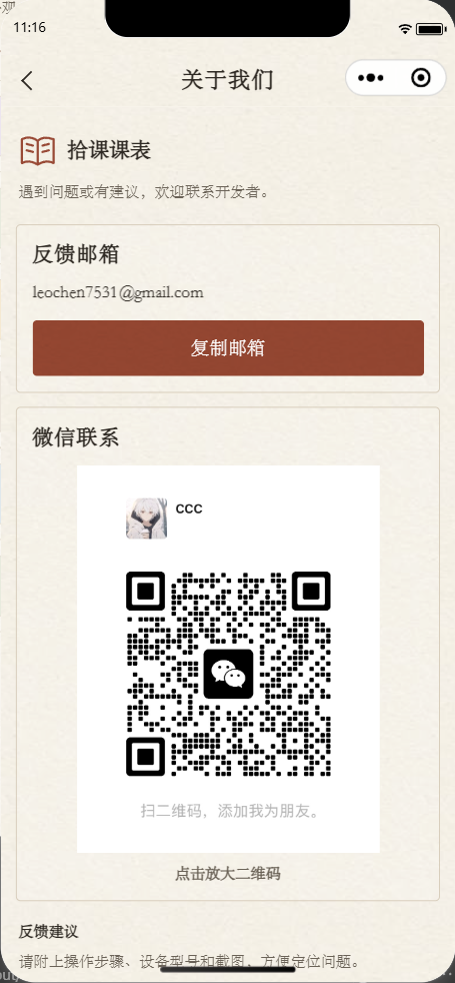
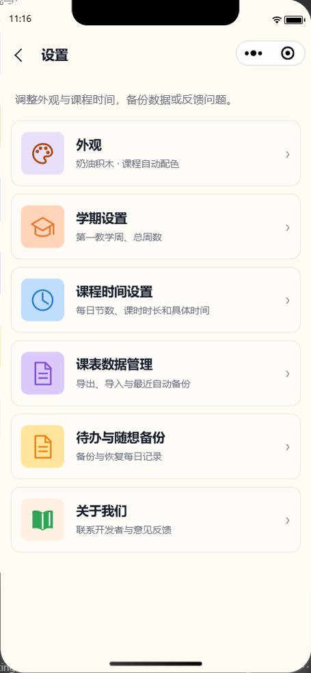

# 界面与文案检查（2026-10-01）

本次接入开发者提供的真实微信二维码，并检查 A「纸上拾课」、B「秩序之间」、C「奶油积木」、E「校园晴日」、F「像素课间」下的全部 12 个页面。沿用既有页面结构、课程竖线样式、主题偏好和数据逻辑。

## 界面调整

| 页面 | 检查与调整 |
| --- | --- |
| 课表 | 检查五套主题的网格、课程文字和工具栏；保留已确认的课程块设计与几何尺寸。 |
| 待办 | 日期与月历工具栏在空间不足时换行；提高随想保存说明和字数统计的字号。 |
| 设置 | 更新功能范围说明；为菜单行加入按压反馈，保留各主题的列表结构。 |
| 外观 | 明确“预览 → 使用”的步骤；未选方案的状态使用次要文字色，当前方案保留强调色。 |
| 学期设置 | 16／18／20 周按钮等宽、保持居中与 44px 触控区域；日期和总周数选择器增加箭头。 |
| 课程时间设置 | 提高规则说明字号；明确手动开始时间、自定义时长的保留规则和最终保存时机。 |
| 单节时间编辑 | 移除重复标题，统一辅助区边角与字号；改用“确认本节时间”，提醒返回上级后保存。 |
| 课程编辑 | B 的标签分隔线贯穿表单行；E 在窄屏下将上课时段纵向排列，避免挤压“重新选择”。 |
| 重选时段 | 移除重复标题，精简点选说明，统一辅助区样式；补充完成按钮的禁用语义。 |
| 课表数据管理 | 导出与导入改用“备份文本”表述，明确合并预览中的新增、重复与冲突课程。 |
| 待办与随想备份 | 缩短说明与标题，保留全部日期覆盖、个人记录和仅存本机等必要信息。 |
| 关于我们 | 接入完整二维码原图；修复微信默认按钮宽度限制，放大二维码，复制按钮至少 48px。 |

单节时间页原有的 A／B／F 卡片规则继承正常，本次只调整重复标题、辅助区和说明层级，没有重复添加卡片主题规则。

## 文案示例

| 原文 | 更新后 |
| --- | --- |
| 同一门课保持同一色位，无需手动选色。 | 课程自动配色；切换外观不会改变课程安排。 |
| 复制课表 JSON | 复制课表备份 |
| 复制待办与随想 JSON | 复制备份文本 |
| 保存本节时间 | 确认本节时间；返回后点击“保存课程时间”生效。 |
| 微信联系方式稍后开放 | 展示已提供的原图，并显示“点击放大二维码”。 |

删除、覆盖、空备份清空、未保存草稿和旧数据迁移的后果提醒继续保留。待办的“已过期”仍符合当前产品规则，没有因文案精简而移除或改变行为。备份编码仍为 JSON，仅调整面向用户的名称。

## 二维码素材

- 原图：888 × 1137 像素，160,753 字节，JPEG。
- 本地资源：`wechat-timetable/miniprogram/assets/about/developer-wechat.jpg`。
- 配置：`wechat-timetable/miniprogram/pages/about/config.ts`，邮箱仍为 `leochen7531@gmail.com`。
- 原图 SHA-256：`93975ee68e9de8a69421abcc0847ddfc3bb3e0b414154bffbd79bb4d5fbbcacd`。
- 按原字节复制，没有裁剪、重新编码、变色、主题滤镜或模拟二维码。

## 自动检查

- `npm.cmd --prefix wechat-timetable run check`：TypeScript 与 400 项测试全部通过，0 失败。日志：`dist/ui-polish-20261001/check.log`。
- `git diff --check`：通过，日志位于同一目录下的 `diff-check.log`。
- 更新关于页测试，检查已确认的邮箱、真实本地资源存在，以及空配置、图片失败、复制与预览回调；更新与此次文案相关的既有断言。
- 五套主题的基础次要文字在页面／卡片底色上、主要按钮文字在按钮底色上的名义对比度均不低于 4.5:1；此项不代表整套界面或真机辅助功能认证。
- 与本轮修改前快照逐文件比较，服务、数据模型、存储工具、主题定义及课程网格没有新增改动，原工作区修改保留。

## 微信开发者工具

使用 iPhone 12/13 (Pro) 模拟器，窗口 390 × 844，基础库 3.17.2：

- 完成 12 页 × 5 主题的 60 个页面组合，记录 60 张初始画面与 25 张底部滚动画面。逐页检查排版、主题继承、文字层级及关键长页的底部留白。
- 所检查的卡片、表单、按钮和二维码没有横向越界；被测主要按钮、步进器和菜单行均至少 44px，五套主题的邮箱复制按钮均为 48px。
- 将每个页面内容区临时限制为 320px，检查已测元素的边界和换行。固定底栏仍参照 390px 视口，未将其相对 320px 内容区的伸出判为溢出。此项不是 320px 设备模拟，不能证明窄视口媒体查询或系统大字号的表现。
- 五套主题均正常加载真实二维码，展示尺寸约 260 × 332.9px，与原图比例一致；没有主题滤镜、裁剪或加载失败状态。
- 本轮矩阵检查未捕获小程序异常。验证前后的真实 Storage 完全一致，模拟数据未写入真实存储，测试接口在结束后恢复。

矩阵截图、原始测量和校验结果分别位于本地忽略目录 `dist/ui-polish-20261001/after/`、该目录下的 `report.json`，以及 `dist/ui-polish-20261001/geometry-summary.json`。

### 联系方式与补充画面

- 五套主题均通过“设置 → 关于我们 → 返回设置”的实际按钮事件验证；直接打开关于页时，返回兜底进入课表首页，好友分享处理器返回首页路径。
- 使用真实代码包图片调用 `wx.getImageInfo` 成功，返回 JPEG、888 × 1137、方向 `up`，本地路径为 `assets/about/developer-wechat.jpg`。点击二维码后，预览请求使用此解析路径，`current` 与 `urls` 一致，并保留长按菜单参数。
- `wx.previewImage` 使用模拟接口核对请求参数，未将实际原生全屏预览或扫码识别计为通过。`wx.setClipboardData` 同样模拟，准确接收 `leochen7531@gmail.com` 并触发“邮箱已复制”；没有覆盖真实系统剪贴板，失败分支由 Node 测试验证。
- 未配置二维码与图片加载失败状态均隐藏二维码按钮，并保留相应提示；未提供无效点击入口。
- 补查五套主题展开月历的正常画面与 320px 内容约束画面；日期、返回今天和收起月历按钮没有挤压重叠。补查最终 C 设置说明，避免将只读联系方式描述为可以“管理联系方式”。
- 补充验证同样没有捕获运行时异常，真实 Storage 前后一致，模拟接口和测试上下文已恢复。开发者工具停留在使用原主题偏好的正常关于页。

补充截图与报告位于 `dist/ui-polish-20261001/contact/`。模拟器截图和几何检查不能替代真机识别、系统剪贴板、系统字号或辅助功能验收。

## 完整 PR 提交复验

本次 PR 包含当前工作区此前的全部项目修改：课程竖线与五套配色、共享课程块样式、外观预览、关于页及真实二维码、UI／文案精修、测试、文档和已确认的设计原图。基线为 `73a1d2bee9b162de444545a47ef5936f3d26670e`，提交分支为 `codex/about-contact-ui-polish`。

- 完整源码与原工作区逐文件比较后，重新执行 `npm.cmd --prefix wechat-timetable run check`：TypeScript 与全部 **400 项测试通过**，0 失败；行／分支／函数覆盖率为 81.35%／88.35%／83.64%。包含课程文字对比度回退与预览配色同步测试。日志：原工作区 `dist/pr-full-check.log`。
- `git diff --check` 通过。代码、测试与原工作区一致；文档补充完整提交说明，设计图和二维码保持原始字节。
- 微信开发者工具重新编译完整项目，在 390×844 原生模拟器下补验五套主题的课表与外观页，共 15 张实际截图。每块课程均有一条有效竖线、无阴影、七日列完整；A 保留纸纹，其他课程块无背景图，F 的像素端点数量正确，五套合成预览均显示课程竖线。
- 本轮补验未捕获运行时异常，真实 Storage 前后一致。报告与完整截图：原工作区 `dist/pr-full-validation/`；代表截图已纳入 `docs/screenshots/course-stripes/`，并链接于[主题系统验收记录](主题系统验收记录.md)。
- 关于页和联系方式的此前独立运行复验仍见本文件上方记录，代表截图为 `docs/screenshots/about-contact/`；真实剪贴板与全屏图片预览未计为通过。前次不含课程样式的 398 项测试结果不作为当前完整提交的测试结论。

## 交付边界

按授权提交全部项目修改到 PR，由维护者手动合并；不上传或发布小程序。真机二维码识别／添加好友、实际系统剪贴板、长按选择、大字号与实际好友／朋友圈分享仍需设备验收。
