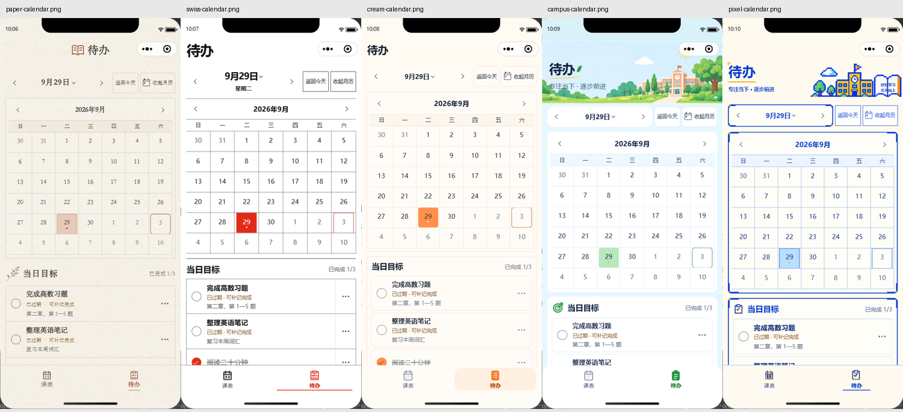
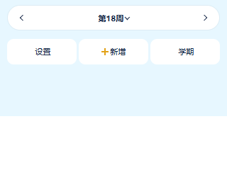
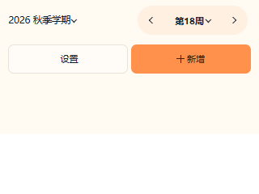

# 界面品质复核（2026-10-03）

## 目标与判断依据

以 Awwwards、Webby Awards、FWA 获奖作品的设计完成度为参考，检查当前原生微信小程序的排版、留白、视觉层级、色彩、动效、微交互、响应式与原创性。获奖是外部评审结论，本记录不声明达到或获得任何奖项。

产品属于每日使用的课表／待办工具。保留用户确认的 A／B／C／E／F 主题、七天同屏、课程竖线、两项底部导航和原始插画。[Webby 官方评审标准](https://www.webbyawards.com/judging-criteria/)强调适合受众的视觉表达、清晰导航、有效交互与整体体验；本轮将这些要求落实为信息可读、尺寸可靠和操作有反馈。

## 逐项判断与改动

| 维度 | 发现及处理 |
| --- | --- |
| 排版 | 五套主题已有稳定的字号、字重和字形规则，保留现有层级；所有主题的周次改为等宽数字，减少切周时数字宽度变化。 |
| 留白 | 保留纸面连续列表、瑞士分隔、奶油区块及校园／像素页头。小屏工具栏分行后有独立操作间距，避免为紧凑排版压缩触控区。 |
| 视觉层级 | 保留学期 → 周次 → 课程、日期 → 目标 → 随想的阅读顺序；小屏 E／F 的周次独立一行，三项操作等分下一行。 |
| 色彩 | 基础主题与稳定课程色位沿用现有规范。复核正文／次要文字／主要按钮 25 组配色，最低对比度 4.56:1；不把此项当作全界面无障碍认证。 |
| 动效 | 勾选标记 160ms、月历展开 180ms／4px；不移动目标行，不增加延迟回调，默认内容可见。F 与减少动态效果偏好关闭新增动画。 |
| 微交互 | 缺少反馈的课表、编辑、备份、作息、返回与 Tab 操作补充共享原生按压状态。禁用的 view 不播放反馈；已有反馈的控件保留。 |
| 响应式 | 修复 E 在 320px 的工具栏越界；320–360px 下 C／E／F 分行，切周／操作触控区仍至少 44px。补充底部 Tab 在窄屏下的 44px 最低高度。A／B 原布局保留。 |
| 原创性 | 保留纸纹与宋体、瑞士大号周次、奶油色块、校园插画和像素几何的五种完整表达。F 的即时反馈匹配其像素风格，其他主题采用短促过渡。 |

课程标签增加完整教室信息，避免只依赖视觉省略后的教室文字；月历日期暴露选中状态；多选期间学期入口补充禁用状态。

## 修改边界

本轮运行时代码只涉及 WXML／WXSS，新增共享 `styles/interaction.wxss`。课程／待办数据模型、服务、存储、路由方法、业务 TypeScript、主题色值、插画、二维码和课程块几何没有修改。没有引入依赖、字体包、后台服务或新的 Storage 字段。

## 验证方法

### 自动检查

- `npm.cmd --prefix wechat-timetable run check`：TypeScript 与全部 400 项测试通过，0 失败。行／分支／函数覆盖率 81.80%／88.58%／83.80%。
- `git diff --check`：通过。
- Impeccable 检测器未返回提示；它对原生 WXML／WXSS 的检查覆盖有限，结果不作为视觉质量通过的依据。

### 响应式与动效样式

- 从实际课表 WXML 提取工具栏，使用真实主题 token、字体和 WXSS，把 `rpx` 按宽度／750 换算后，在 Edge 渲染。
- 320／360／375／390／430／768px × 五主题，共 30 个布局组合：被测工具栏无横向越界，切周与操作按钮至少 44px。
- 同样六种宽度补测底部双 Tab：320px 下高度 44px，其余宽度随原有 `96rpx` 增长，均不低于 44px。此项是最终触控核对发现的小屏下限修正，390px 原生画面不受影响。
- 五主题 × 普通／减少动态效果，共 10 个动效组合：普通主题的 160ms／180ms 动画有效，F 与减少动态效果时关闭新增过渡和动画。
- 这些是浏览器对布局与媒体查询的验证，不等同于对应尺寸的微信模拟器或 iPad／Android 真机验收。原生模拟器中的 320px 内容约束记录只用于发现压力点，不当作真实 320px 设备。

### 微信原生复验

原生运行使用 iPhone 12/13 (Pro)、390×844、基础库 3.17.2。第一轮查看五主题的课表、待办与外观页共 15 个组合；第二轮复核全部 12 页 × 五主题，并检查实际按钮事件和运行时样式。

- 第二轮完成 **60 个页面／主题组合**，保存 6 张代表截图，未捕获运行时异常；被测 `.pressable` 操作区域没有横向越界。
- 五套主题均通过切周按钮、进入设置再返回并保留浏览周次、多选期间禁止切周、目标完成／恢复、月历展开 42 格、日期选中语义、外观只预览不应用的检查。作息加减节次也通过实际按钮事件检查。
- 原生 computed style 确认 A／B／C／E 的月历动画 180ms、勾选动画 160ms，F 为 `none`；截图确认展开后的文字、网格与选中状态清楚可见。
- 首轮与复验都使用内存隔离数据，结束后恢复模拟接口，并逐项对比真实 Storage：**前后完全一致**。复验只在内存中的待办数据执行完成／恢复，未写入真实课程、待办或外观偏好。
- 验证脚本最初暴露了两项测试工具问题：按钮事件后立即读取会取得旧值，按标签查询自定义组件会返回空。补充短暂渲染等待、按现有组件 class 定位后完成整轮复验，没有为此修改业务代码。

## 本地证据

代表截图已随本次 PR 归档，便于在其他电脑直接审查：

上图来自 390×844 微信模拟器，内容为隔离示例。以下两图是 320px 浏览器布局验证，只展示真实 WXSS 的工具栏排布，不代表微信真机画面：

所有完整输出位于忽略目录 `dist/craft-20261003/`，不包含真实 Storage 快照：

- `before/`：首轮原生截图与测量。
- `after/`：复验截图、页面尺寸、实际事件断言与运行时动效参数。
- `responsive-after/`：30 个布局组合报告及代表图。
- `motion-contrast.json`：10 个动效组合与 25 组对比度。
- `tabs.json`：六种宽度的底部 Tab 尺寸。
- `check.log`、`detector.json`：自动检查与检测器输出。

## 证据边界

没有把模拟器或浏览器测试等同于真机手感、系统大字号、VoiceOver／TalkBack、键盘遮挡或帧率认证。新增减少动态效果样式已在浏览器中验证，微信真机是否传递该系统媒体偏好仍需设备确认；原有切周 swiper 和长按选择提示不在本轮动效改动内。

按维护者后续授权，本轮全部界面代码与文档通过独立 PR 交付，由维护者手动合并；不自动合并，也不上传或发布小程序。

提交前重新运行 `npm.cmd --prefix wechat-timetable run check`，TypeScript 与 400 项测试通过，0 失败；本次行／分支／函数覆盖率为 81.74%／88.50%／83.80%，日志为 `dist/craft-20261003/pr-check.log`。README、CHANGELOG 和 DESIGN 已同步，业务逻辑、依赖、数据格式与原始素材未修改。

本轮已修复检查覆盖范围内明确的布局与反馈缺口；最终复核未发现需要继续修改的高价值问题。后续以真实设备反馈或新增具体缺陷为下一轮优化依据。
